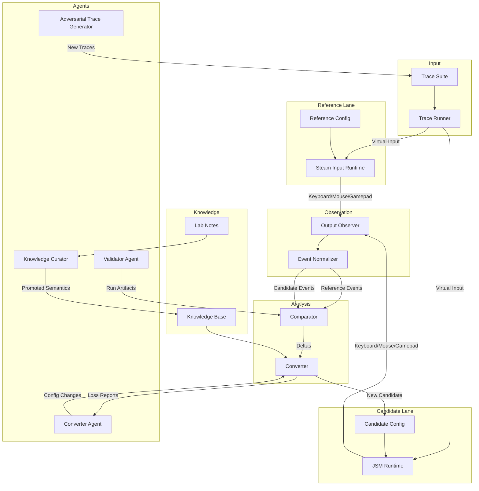

# Design Document: JyroPort

## Overview

JyroPort is an agent-first behavioral conversion lab for gamepad mapper configurations. It converts configurations between Steam Input and JoyShockMapper (JSM), starting with Steam Input to JSM while preserving architectural support for bidirectional conversion. The system measures behavioral equivalence by comparing real mapper outputs given identical controller input traces, not just syntactic translation. The lab enables isolated agents to iterate through structured artifacts, track conversion quality across multiple dimensions, and build a knowledge base of mapper semantics backed by runtime evidence.

The core principle is that real Steam Input versus real JSM comparison is authoritative. Generated JSM configs must behave correctly in real JSM on Windows to be useful. The system supports exact matches, bounded approximations, degraded approximations, explicitly unsupported features, and user-choice scenarios, with cycle-by-cycle tracking of improvement, regression, or plateau states.

## Architecture



### Data Flow

1. **Trace Execution**: Trace runner emits deterministic virtual controller input to both mapper lanes simultaneously
2. **Mapper Processing**: Reference lane (Steam Input) and candidate lane (JSM) process input through their respective configs
3. **Output Capture**: Output observer captures keyboard, mouse, virtual gamepad, and motion output from both mappers
4. **Normalization**: Event normalizer converts mapper-specific output into canonical typed events
5. **Comparison**: Comparator computes behavioral deltas between reference and candidate event streams
6. **Analysis**: Converter generates loss reports classifying each feature's conversion quality
7. **Iteration**: Converter agent updates conversion rules and emits new candidate configs
8. **Knowledge Building**: Lab notes accumulate observations; knowledge curator promotes evidence-backed semantics to canonical knowledge base

## Components and Interfaces

### Trace Runner

**Purpose**: Emit deterministic virtual controller input to drive both mapper lanes

**Interface**:
```typescript
interface TraceRunner {
  loadTrace(tracePath: string): Result<Trace>
  executeTrace(trace: Trace, targets: MapperTarget[]): Result<ExecutionHandle>
  getExecutionStatus(handle: ExecutionHandle): ExecutionStatus
}

interface Trace {
  version: string
  profile: ControllerProfile
  frames: Frame[]
  metadata: TraceMetadata
}

interface Frame {
  timestamp: number  // microseconds
  buttons: ButtonState[]
  axes: AxisState[]
  gyro?: GyroState
  accel?: AccelState
}
```

**Responsibilities**:
- Parse versioned trace files
- Emit controller frames with deterministic timing
- Support multiple simultaneous mapper targets
- Maintain frame-accurate synchronization

### Output Observer

**Purpose**: Capture all observable output from mapper runtimes

**Interface**:
```typescript
interface OutputObserver {
  startCapture(target: MapperTarget): Result<CaptureHandle>
  stopCapture(handle: CaptureHandle): Result<RawEvents>
  getCaptureStatus(handle: CaptureHandle): CaptureStatus
}

interface RawEvents {
  keyboard: KeyboardEvent[]
  mouse: MouseEvent[]
  virtualGamepad: GamepadEvent[]
  motion: MotionEvent[]
  haptics?: HapticEvent[]  // future
}

interface KeyboardEvent {
  timestamp: number
  scancode: number
  keycode: string
  state: 'down' | 'up'
}

interface MouseEvent {
  timestamp: number
  type: 'button' | 'move' | 'wheel'
  button?: number
  state?: 'down' | 'up'
  deltaX?: number
  deltaY?: number
  wheelDelta?: number
}
```

**Responsibilities**:
- Capture keyboard scancodes and key events
- Capture mouse button, movement, and wheel events
- Capture virtual gamepad button and axis state
- Record motion output when observable
- Timestamp all events with microsecond precision
- Isolate capture per mapper target

### Event Normalizer

**Purpose**: Convert mapper-specific output into canonical typed events

**Interface**:
```typescript
interface EventNormalizer {
  normalize(raw: RawEvents, mapper: MapperType): Result<NormalizedEvents>
  validateSchema(events: NormalizedEvents): Result<void>
}

interface NormalizedEvents {
  events: NormalizedEvent[]
  metadata: NormalizationMetadata
}

interface NormalizedEvent {
  timestamp: number
  type: 'keyboard' | 'mouse_button' | 'mouse_move' | 'mouse_wheel' | 'gamepad_button' | 'gamepad_axis' | 'motion'
  action: 'press' | 'release' | 'move' | 'set'
  target: string  // key name, button name, axis name
  value?: number  // for analog events
  metadata?: Record<string, any>
}
```

**Responsibilities**:
- Map platform-specific scancodes to canonical key names
- Normalize mouse coordinates and deltas
- Normalize gamepad button and axis identifiers
- Preserve timing precision
- Validate against event schema
- Tag events with mapper source

### Comparator

**Purpose**: Compute behavioral deltas between reference and candidate event streams

**Interface**:
```typescript
interface Comparator {
  compare(reference: NormalizedEvents, candidate: NormalizedEvents, rules: ComparisonRules): Result<Delta>
  classifyDelta(delta: Delta, feature: FeatureId): Classification
}

interface Delta {
  exact: ExactMatch[]
  tolerant: TolerantMatch[]
  missing: MissingEvent[]
  extra: ExtraEvent[]
  timing: TimingDelta[]
  value: ValueDelta[]
  sequence: SequenceDelta[]
}

interface ComparisonRules {
  exactMatchTypes: EventType[]
  timingToleranceUs: number
  valueTolerancePercent: number
  sequenceRules: SequenceRule[]
}

type Classification = 
  | 'exact'
  | 'bounded_approximation'
  | 'degraded_approximation'
  | 'unsupported_omitted'
  | 'requires_user_choice'
```

**Responsibilities**:
- Match events between reference and candidate streams
- Apply exact and tolerant comparison rules
- Identify missing, extra, and mismatched events
- Compute timing and value deltas
- Detect sequence order violations
- Classify behavioral differences per feature

### Converter

**Purpose**: Generate candidate configs and structured loss reports

**Interface**:
```typescript
interface Converter {
  convert(source: SourceConfig, knowledge: KnowledgeBase): Result<ConversionResult>
  repair(candidate: CandidateConfig, loss: LossReport, cycle: CycleHistory): Result<ConversionResult>
}

interface ConversionResult {
  candidate: CandidateConfig
  loss: LossReport
  cycleUpdate: CycleUpdate
  stopReason: StopReason
}

interface LossReport {
  features: FeatureLoss[]
  summary: LossSummary
}

interface FeatureLoss {
  featureId: string
  classification: Classification
  explanation: string
  evidence: EvidenceLink[]
  confidence: number
}

type StopReason = 
  | 'exact'
  | 'under_tolerance'
  | 'plateaued'
  | 'oscillating'
  | 'unsupported'
  | 'max_cycles'
  | 'blocked_by_mapper_capability'
  | 'blocked_by_regression_risk'
```

**Responsibilities**:
- Parse source mapper configs
- Generate syntactically valid target configs
- Classify conversion quality per feature
- Explain approximations and losses
- Track cycle-by-cycle improvement
- Determine stop conditions
- Query knowledge base for mapper semantics

### Knowledge Base

**Purpose**: Store and retrieve learned mapper behavior backed by runtime evidence

**Interface**:
```typescript
interface KnowledgeBase {
  queryControl(controlId: string): Result<ControlSemantics>
  queryMapperFunction(mapper: MapperType, functionId: string): Result<FunctionSemantics>
  queryEquivalence(sourceFunction: string, targetMapper: MapperType): Result<EquivalenceRule[]>
  getCapabilityMatrix(): CapabilityMatrix
}

interface ControlSemantics {
  controlId: string
  type: 'button' | 'axis' | 'trigger' | 'gyro' | 'accel'
  neutralValue?: number
  range?: [number, number]
  unit?: string
  provenance: Provenance[]
}

interface FunctionSemantics {
  functionId: string
  mapper: MapperType
  syntax: string
  behavior: string
  parameters: Parameter[]
  constraints: Constraint[]
  provenance: Provenance[]
}

interface EquivalenceRule {
  sourceFunction: string
  targetFunction: string
  classification: Classification
  conditions: Condition[]
  evidence: EvidenceLink[]
  lastValidated: string  // ISO 8601
}
```

**Responsibilities**:
- Catalog controller controls with semantic metadata
- Document mapper function behavior
- Store equivalence rules between mappers
- Maintain capability matrix
- Track provenance for all entries
- Separate lab notes from canonical knowledge
- Enforce promotion rules for canonical entries

## Data Models

### Run Manifest

```typescript
interface RunManifest {
  runId: string
  timestamp: string  // ISO 8601
  environment: Environment
  mappers: MapperVersions
  controller: ControllerProfile
  traceSuite: TraceSuiteRef
  sourceHash: string
  candidateHash: string
  artifacts: ArtifactPaths
}

interface Environment {
  os: string
  osVersion: string
  kernel?: string
  arch: string
  hostname: string
  user: string
}

interface MapperVersions {
  reference: MapperVersion
  candidate: MapperVersion
}

interface MapperVersion {
  type: 'steam_input' | 'jsm'
  version: string
  commit?: string
  buildConfig: string
}
```

**Validation Rules**:
- `runId` must be unique UUID
- `timestamp` must be valid ISO 8601 with timezone
- All artifact paths must be relative to run directory
- Hashes must be SHA-256

### Cycle History

```typescript
interface CycleHistory {
  featureId: string
  traceId: string
  metric: Metric
  cycles: CycleRecord[]
}

interface CycleRecord {
  cycleNumber: number
  timestamp: string
  currentError: number
  previousError?: number
  bestError: number
  trend: 'new' | 'improved' | 'regressed' | 'unchanged' | 'incomparable'
  classification: Classification
  confidence: number
  stopReason?: StopReason
}

interface Metric {
  name: string
  unit: string
  comparisonRule: 'minimize' | 'maximize' | 'target'
  targetValue?: number
}
```

**Validation Rules**:
- `cycleNumber` must be sequential starting from 1
- `currentError` must be non-negative
- `bestError` must be minimum of all `currentError` values
- `trend` must be computed from `currentError` vs `previousError`
- `confidence` must be in range [0.0, 1.0]

### Trace Suite

```typescript
interface TraceSuite {
  suiteId: string
  version: string
  traces: TraceRef[]
  targetedFeatures: string[]
  accessLevel: 'tuning' | 'regression' | 'holdout'
  parentSuite?: string
  mutationSource?: string
  intent: string
}

interface TraceRef {
  traceId: string
  path: string
  hash: string
  targetedFeatures: string[]
  intent: string
}

interface TraceMetadata {
  traceId: string
  version: string
  created: string
  profile: ControllerProfile
  duration: number  // microseconds
  frameCount: number
  targetedFeatures: string[]
  intent: string
}
```

**Validation Rules**:
- Traces within a versioned suite are immutable
- `accessLevel` determines converter visibility
- `intent` must explain what behavioral difference the trace exposes
- `hash` must match trace file content

### Controller Profile

```typescript
interface ControllerProfile {
  profileId: string
  name: string
  buttons: ButtonDef[]
  axes: AxisDef[]
  triggers: TriggerDef[]
  gyro?: GyroDef
  accel?: AccelDef
  features: string[]
  excluded: string[]
}

interface ButtonDef {
  id: string
  name: string
  type: 'digital'
}

interface AxisDef {
  id: string
  name: string
  type: 'analog'
  neutralValue: number
  range: [number, number]
  unit: string
}

interface TriggerDef {
  id: string
  name: string
  type: 'trigger'
  neutralValue: number
  range: [number, number]
  unit: string
}

interface GyroDef {
  axes: ['pitch', 'yaw', 'roll']
  unit: 'deg/s' | 'rad/s'
  range: [number, number]
  sampleRate: number
  coordinateFrame: string
}
```

**Validation Rules**:
- Canonical v1 profile based on extended gyro gamepad (8BitDo Ultimate 2 Wireless)
- Excludes touchpad position, touchpad surface, adaptive triggers, microphone button
- All axis ranges, neutral values, units, and coordinate frames must be declared
- Sample rate and timestamp source must be specified for gyro/accel

## Correctness Properties

### Property 1: Trace Determinism

**Statement**: For any trace T and mapper configuration C, executing T against C multiple times produces identical event sequences within timing tolerance.

**Formalization**:
```
∀ trace T, config C, runs R₁ R₂:
  execute(T, C) = R₁ ∧ execute(T, C) = R₂ ⟹
  events(R₁) ≈ₜ events(R₂)
```

Where `≈ₜ` denotes equivalence within timing tolerance defined in comparison rules.

**Verification**: Run same trace against same config 10 times; all event sequences must match within timing tolerance.

**Validates: Requirements 10.1, 10.2**

### Property 2: Event Normalization Invertibility

**Statement**: Normalizing and denormalizing events preserves semantic equivalence.

**Formalization**:
```
∀ raw events E, mapper M:
  denormalize(normalize(E, M), M) ≈ₛ E
```

Where `≈ₛ` denotes semantic equivalence (same user-observable behavior).

**Verification**: Round-trip test for each event type and mapper combination.

**Validates: Requirements 3.1, 3.2, 3.3, 3.4**

### Property 3: Classification Monotonicity

**Statement**: Improving a feature's error metric cannot worsen its classification.

**Formalization**:
```
∀ feature F, cycles C₁ C₂:
  error(F, C₂) < error(F, C₁) ⟹
  classification(F, C₂) ≥ classification(F, C₁)
```

Where classification ordering is: `exact` > `bounded_approximation` > `degraded_approximation` > `unsupported_omitted`.

**Verification**: Check all cycle history records for classification regressions when error improves.

**Validates: Requirements 13.3, 17.5**

### Property 4: Holdout Trace Isolation

**Statement**: Converter agents never receive holdout trace contents or feature-specific feedback from holdout traces.

**Formalization**:
```
∀ trace T, suite S:
  accessLevel(T, S) = 'holdout' ⟹
  ¬visible(T, ConverterAgent)
```

**Verification**: Audit all converter task briefs and knowledge base entries for holdout trace references.

**Validates: Requirements 8.4, 8.7**

### Property 5: Knowledge Base Provenance

**Statement**: Every canonical knowledge base entry has at least one real-runtime evidence link.

**Formalization**:
```
∀ entry E ∈ KnowledgeBase.canonical:
  ∃ evidence V ∈ E.provenance:
    V.source = 'real_runtime' ∧ V.validated = true
```

**Verification**: Schema validation on canonical knowledge base files; reject entries without real-runtime provenance.

**Validates: Requirements 6.6**

### Property 6: Non-Regression Acceptance

**Statement**: A conversion change is accepted only if no feature regresses without explicit justification.

**Formalization**:
```
∀ change Δ, features F:
  accept(Δ) ⟹
  ∀ f ∈ F: ¬regressed(f, Δ) ∨ justified(f, Δ)
```

Where `justified(f, Δ)` requires naming affected feature, user-visible loss, unavoidability reason, and follow-up task.

**Verification**: Validation policy enforcement in acceptance gate; require regression justification document for any regressed feature.

**Validates: Requirements 13.1, 13.2, 13.4**

### Property 7: Platform Parity

**Statement**: Linux lab results transfer to Windows within declared platform delta tolerances.

**Formalization**:
```
∀ trace T, config C:
  result_linux(T, C) ≈ₚ result_windows(T, C)
```

Where `≈ₚ` denotes equivalence within platform-specific delta tolerances recorded in platform delta catalog.

**Verification**: Early parity gate in Phase 1 and Phase 2; repeat key traces on Windows before expensive infrastructure work.

**Validates: Requirements 11.1, 11.2, 11.3, 11.4**

### Property 8: Headless JSM Parity

**Statement**: Headless JSM matches real JSM within feature-class tolerances before that class is used for acceleration.

**Formalization**:
```
∀ feature class FC:
  use_headless(FC) ⟹
  ∃ parity_result PR:
    PR.feature_class = FC ∧
    PR.headless ≈ₜ PR.real_jsm ∧
    PR.validated = true
```

**Verification**: Phase 5 gate requires parity certification per feature class before headless acceleration is enabled.

**Validates: Requirements 12.1, 12.2, 12.3, 12.4**

## Error Handling

### Error Scenario 1: Trace Execution Failure

**Condition**: Trace runner cannot execute trace due to invalid format, missing controller profile, or runtime error

**Response**: 
- Abort run immediately
- Write error to run manifest
- Preserve partial artifacts with error marker
- Do not emit delta or loss reports

**Recovery**:
- Validate trace schema before execution
- Provide clear error messages with trace line numbers
- Support trace validation as standalone operation

### Error Scenario 2: Output Capture Timeout

**Condition**: Output observer does not receive expected events within timeout window

**Response**:
- Mark capture as incomplete
- Record timeout in capture metadata
- Emit partial events with timeout marker
- Continue to comparison with incomplete flag

**Recovery**:
- Configure timeout based on trace duration + safety margin
- Support manual timeout override for long traces
- Log mapper stderr/stdout for debugging

### Error Scenario 3: Event Normalization Failure

**Condition**: Raw events contain unrecognized event types or malformed data

**Response**:
- Log unrecognized events with raw data
- Emit normalized events for recognized subset
- Mark normalization as partial in metadata
- Continue to comparison with warning

**Recovery**:
- Extend event normalizer schema for new event types
- Validate raw event schema before normalization
- Provide fallback for unknown events

### Error Scenario 4: Comparison Rule Conflict

**Condition**: Multiple comparison rules apply to same event pair with conflicting tolerances

**Response**:
- Use most conservative (strictest) rule
- Log rule conflict with event details
- Mark delta with conflict warning
- Continue comparison

**Recovery**:
- Review comparison rules for overlaps
- Define rule precedence order
- Validate rule set before comparison

### Error Scenario 5: Converter Oscillation

**Condition**: Converter cycles between two or more candidate configs without improvement

**Response**:
- Detect oscillation after 3 cycles with same error
- Set stop reason to 'oscillating'
- Emit loss report with oscillation details
- Halt converter iteration for that feature

**Recovery**:
- Review cycle history for oscillation patterns
- Add oscillation detection to converter
- Require manual intervention or rule change

### Error Scenario 6: Knowledge Base Conflict

**Condition**: New observation contradicts existing canonical knowledge base entry

**Response**:
- Append observation to lab notes with conflict marker
- Do not overwrite canonical entry
- Escalate to knowledge curator agent
- Continue using existing canonical entry

**Recovery**:
- Knowledge curator reviews both entries
- Determines scope or conditions for each
- Updates canonical entry or splits into conditional rules
- Documents resolution in provenance

## Testing Strategy

### Unit Testing Approach

**Trace Runner**:
- Parse valid and invalid trace files
- Emit frames with correct timing
- Handle multiple simultaneous targets
- Validate frame synchronization

**Event Normalizer**:
- Normalize all event types for each mapper
- Handle platform-specific scancodes
- Preserve timing precision
- Validate schema compliance

**Comparator**:
- Match exact events
- Apply timing tolerances
- Apply value tolerances
- Detect missing and extra events
- Classify deltas correctly

**Converter**:
- Parse source configs
- Generate valid target configs
- Classify features correctly
- Track cycle history
- Detect stop conditions

### Property-Based Testing Approach

**Property Test Library**: fast-check (TypeScript/JavaScript), hypothesis (Python)

**Property 1: Trace Determinism**
- Generate random traces
- Execute same trace multiple times
- Assert event sequences match within tolerance

**Property 2: Event Normalization Invertibility**
- Generate random raw events
- Normalize and denormalize
- Assert semantic equivalence

**Property 3: Classification Monotonicity**
- Generate cycle histories with improving errors
- Assert classifications never worsen

**Property 4: Comparison Symmetry**
- Generate event pairs
- Compare in both directions
- Assert delta magnitude is symmetric

### Integration Testing Approach

**Phase 1 Gate Test**:
- Build JSM on Linux
- Run minimal smoke config
- Verify exact event counts and order
- Repeat on Windows
- Compare Linux vs Windows results

**Phase 2 Gate Test**:
- Drive Steam Input with controlled trace
- Drive JSM with equivalent config
- Capture outputs from both
- Normalize events
- Compute delta
- Verify delta structure

**Phase 4 Gate Test**:
- Execute full orchestration run
- Verify all artifacts are generated
- Validate artifact schemas
- Check artifact consistency

**Phase 5 Gate Test**:
- Run same trace through real JSM and headless JSM
- Compare event streams
- Verify parity within tolerances
- Repeat for each feature class

## Performance Considerations

**Trace Execution**:
- Target 1000 Hz frame rate for high-precision input
- Support variable frame rates for different trace types
- Minimize latency between trace runner and mapper lanes

**Output Capture**:
- Use efficient event capture mechanisms (e.g., evdev on Linux, raw input on Windows)
- Buffer events to avoid blocking mapper execution
- Support high-frequency mouse and gyro events

**Event Normalization**:
- Optimize for large event streams (10K+ events per run)
- Use streaming normalization to reduce memory footprint
- Cache mapper-specific normalization rules

**Comparison**:
- Use efficient event matching algorithms (O(n log n) or better)
- Support incremental comparison for long traces
- Parallelize independent feature comparisons

**Headless JSM**:
- Minimize overhead of synthetic input injection
- Use deterministic time to eliminate timing variance
- Share code paths with real JSM to avoid divergence

## Security Considerations

**Trace Files**:
- Validate trace schema before execution to prevent injection attacks
- Limit trace file size to prevent resource exhaustion
- Sanitize trace metadata to prevent path traversal

**Config Files**:
- Validate config syntax before execution
- Sandbox mapper execution to prevent arbitrary code execution
- Limit config file size and complexity

**Output Capture**:
- Isolate capture per mapper to prevent cross-contamination
- Sanitize captured events before storage
- Limit capture duration to prevent resource exhaustion

**Knowledge Base**:
- Validate provenance links to prevent false evidence
- Require authentication for canonical entry promotion
- Audit all knowledge base changes

**Agent Isolation**:
- Enforce access level for trace suites (tuning/regression/holdout)
- Prevent converter agents from accessing holdout traces
- Audit agent task briefs for information leakage

## Dependencies

**Runtime Dependencies**:
- Steam Input runtime (Windows, Linux)
- JoyShockMapper (Windows, Linux)
- Virtual controller driver (e.g., ViGEm on Windows, uinput on Linux)
- Input event capture (e.g., evdev on Linux, raw input on Windows)

**Build Dependencies**:
- CMake 3.28+
- C++23 compiler (MSVC 2022, Clang, GCC)
- SDL3 or JoyShockLibrary backend
- Platform-specific input/output libraries

**Test Dependencies**:
- Property-based testing library (fast-check, hypothesis)
- JSON schema validator
- Trace file generator
- Event stream diff tool

**Agent Dependencies**:
- Task orchestration system
- Artifact storage (file system or object store)
- Knowledge base storage (JSON files or database)
- Provenance tracking system

## Phase Implementation Plan

### Phase 1: Feasibility Gates

**Goal**: Prove JSM can be built and observed on Linux; validate Windows parity

**Tasks**:
1. Build JSM on Linux with non-semantic changes only
2. Run minimal smoke test on Linux (S = SPACE, ZR = LMOUSE)
3. Run matching smoke test on Windows
4. Decide Linux lab viability (linux-main, linux-build-only, or linux-rejected)

**Gate Criteria**:
- Linux build succeeds
- Linux smoke test passes or block reason documented
- Windows smoke test matches Linux results
- Decision documented in `linux-lab-decision.md`

### Phase 2: Steam/JSM A-B Proof

**Goal**: Prove controlled comparison between real Steam Input and real JSM

**Tasks**:
1. Drive Steam Input with controlled virtual input
2. Capture Steam Input output as typed events
3. Create hand-authored equivalent JSM config
4. Drive JSM with same virtual input
5. Capture JSM output as typed events
6. Compare outputs
7. Repeat or certify on Windows

**Gate Criteria**:
- One trace drives both mappers
- Both outputs captured as typed events
- Delta computed and written
- Windows validation completed or explicitly blocked

### Phase 3: Artifact Contracts

**Goal**: Define stable schemas for all artifacts

**Tasks**:
1. Define trace format schema
2. Define normalized event format schema
3. Define delta, loss, cycle-history schemas
4. Define run manifest and environment schema
5. Define knowledge base note and promotion schemas

**Gate Criteria**:
- All schemas have JSON Schema definitions
- Validating examples exist for each schema
- Schema versioning strategy documented

### Phase 4: Real Runtime Harness

**Goal**: Build repeatable orchestration for full runs

**Tasks**:
1. Generalize Steam Input lane
2. Generalize JSM lane
3. Add output observers for all event types
4. Add comparator with configurable rules
5. Add run orchestration

**Gate Criteria**:
- One orchestration run produces all artifacts
- Artifacts validate against schemas
- Run is repeatable with same results

### Phase 5: Headless Acceleration

**Goal**: Enable headless JSM for faster iteration after proving parity

**Tasks**:
1. Add synthetic JslWrapper for input injection
2. Add recording for keyboard/mouse output
3. Add recording for virtual gamepad output
4. Add deterministic trace-time control
5. Certify headless JSM against real JSM per feature class

**Gate Criteria**:
- Each feature class has parity certification
- Headless JSM matches real JSM within tolerances
- Parity tests run on Windows

### Phase 6: Trace Intelligence

**Goal**: Enable adversarial trace generation for comprehensive coverage

**Tasks**:
1. Create baseline traces for common scenarios
2. Implement adversarial trace generator agent
3. Generate boundary and mutation traces
4. Generate regression traces from previous deltas
5. Generate holdout traces for validation

**Gate Criteria**:
- Adversarial trace generator writes versioned suites
- Trace manifests include intent and targeted features
- Tuning/regression/holdout access rules enforced

### Phase 7: Knowledge Base

**Goal**: Build evidence-backed knowledge base of mapper semantics

**Tasks**:
1. Record lab observations from runs
2. Promote verified JSM behavior notes
3. Promote verified Steam Input behavior notes
4. Promote equivalence rules with evidence
5. Maintain capability matrix

**Gate Criteria**:
- Canonical entries require real-runtime evidence
- Promotion rules enforced
- Conflict handling documented

### Phase 8: Converter Work

**Goal**: Build iterative converter with loss tracking

**Tasks**:
1. Implement Steam Input layout parser
2. Implement JSM config emitter
3. Implement loss classifier
4. Implement iterative repair loop
5. Build Windows regression suite
6. (Future) Add JSM-to-Steam path

**Gate Criteria**:
- Converter produces candidate config and loss report
- Cycle history tracks improvement/regression/plateau
- No unaccepted regressions
- Windows regression suite passes

## Open Risks

1. **Steam Input Opacity**: Steam Input layout generation and runtime control may be more opaque than JSM config generation, requiring reverse engineering or API discovery

2. **Virtual Controller Shape**: Virtual controller shape may be constrained by what Steam Input and JSM reliably recognize, limiting feature coverage

3. **Linux-Windows Transfer**: Linux automation may not transfer closely enough to Windows for some output channels (mouse deltas, timing, gyro behavior)

4. **Tolerance Models**: Mouse deltas, timing, and gyro behavior will need careful tolerance models to distinguish acceptable approximations from real failures

5. **Headless JSM Refactoring**: Headless JSM may require careful refactoring to avoid accidentally changing runtime behavior while adding test instrumentation

6. **Knowledge Base Speculation**: Knowledge base promotion needs strict evidence rules to avoid turning speculation into converter logic

7. **Agent Task Decomposition**: Broad phase labels must be decomposed into bounded task briefs with clear inputs, outputs, and acceptance criteria before agent execution

8. **Platform Delta Catalog**: Platform-specific differences must be cataloged and distinguished from conversion failures to avoid false negatives

## Approval State

This design formalizes the JyroPort gamepad mapper conversion lab architecture. It establishes:
- Real-runtime behavioral comparison as authoritative
- Agent-first artifact-driven workflow
- Eight-phase implementation with gate criteria
- Structured result classifications and cycle tracking
- Adversarial trace generation without score-chasing
- Evidence-backed knowledge base with promotion rules
- Early Windows parity validation
- Non-semantic JSM change boundaries

The design supports bidirectional conversion (Steam Input ↔ JSM) while prioritizing Steam Input → JSM for initial implementation.
